# Проект по автоматизации API тестирования на DEMOQA
<a href="https://demoqa.com/"></a>

## :point_up: Структура:

- <a href="#point_up_2-технологии-и-инструменты">Стек</a>
- <a href="#point_up_2-проведенные автотесты">Проведенные автотесты</a>
- <a href="#point_up_2-сборка-в-Jenkins">Сборка в Jenkins</a>
- <a href="#point_up_2-запуск-из-терминала">Запуск из терминала</a>
- <a href="#point_up_2-allure-отчет">Allure отчет</a>
- <a href="#point_up_2-интеграция-с-allure-testops">Интеграция с Allure TestOps</a>
- <a href="#point_up_2-интеграция-с-jira">Интеграция с Jira</a>
- <a href="#point_up_2-отчет-в-telegram">Отчет в Telegram</a>

## :point_up_2: Стек

<p align="center">


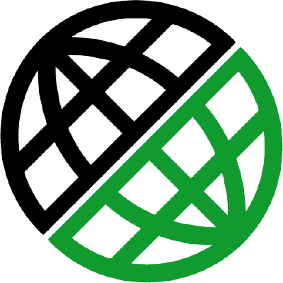
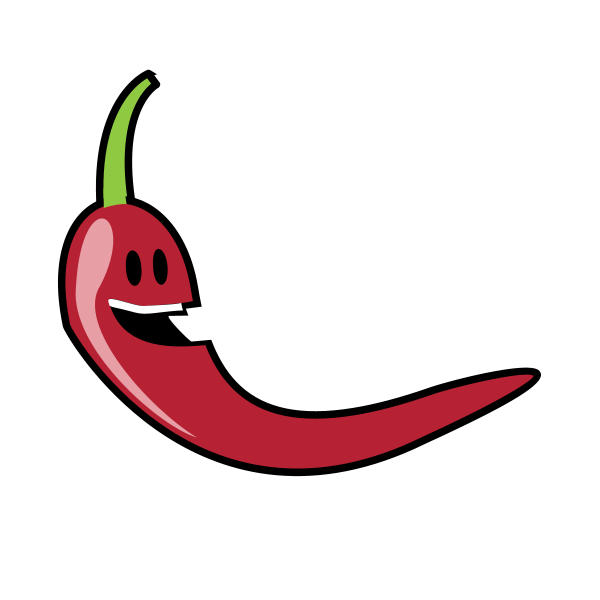
</p>

## :point_up_2: Проведенные автотесты
- Тесты с данными пользователей на DEMOQA
  - Успешная авторизация и получение токена с корректными данными
  - Неуспешная авторизация с некорректными данными
  - Неуспешная авторизация отсутствующего пользователя в базе
  - Неуспешная авторизация с отправкой пустых полей
  - Неуспешная повторная регистрация уже зарегистрированного пользователя
  - Успешное добавление и удаление нового пользователя

- Тесты с данными книг на DEMOQA
  - Проверка библиотеки книг по названиям
  - Проверка характеристик книги по ISBN
  - Проверка отсутствия книги по ISBN

## :point_up_2: Сборка в Jenkins
[**Сборка в Jenkins**](https://jenkins.autotests.cloud/job/demoqa-api-test/)
<p>
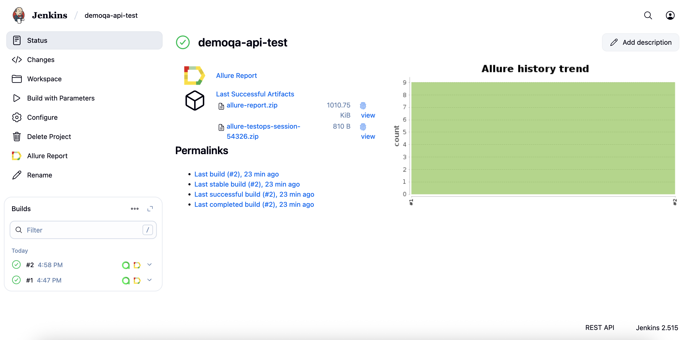
</p>

### Параметры сборки в Jenkins:
Сборка в Jenkins

- task (выбор групп тестов)
- baseUri (базовый URI, по умолчанию: https://demoqa.com/ )

## :point_up_2: Запуск из терминала
Локальный запуск:
```
gradle clean api
```
Удаленный запуск:
```
clean 
${TASK} 
-DbaseUri=${BASE_URI}
```

## :point_up_2: Allure отчет

[Allure отчет](https://jenkins.autotests.cloud/job/demoqa-api-test/allure/)

- ### Главный экран отчета
<p>
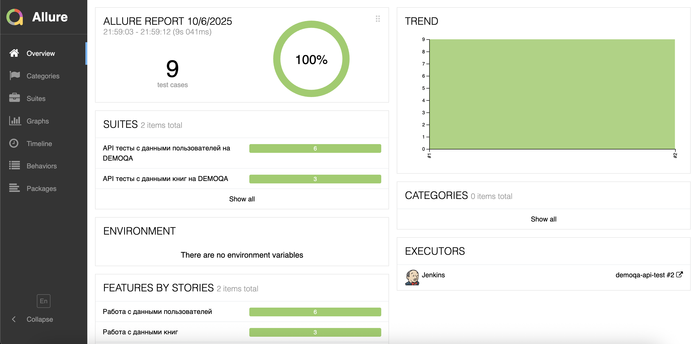
</p>

- ### Страница с проведенными тестами
<p>
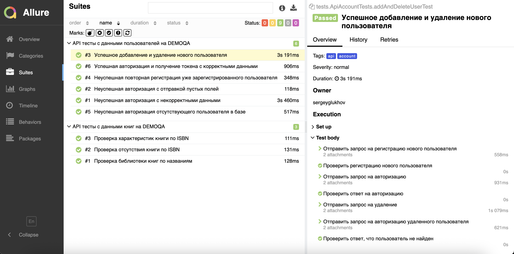
</p>

## :point_up_2: Интеграция с Allure TestOps

[Проект в Allure TestOps](https://allure.autotests.cloud/project/4938/dashboards)

- ### Экран с результатами запуска тестов
<p>
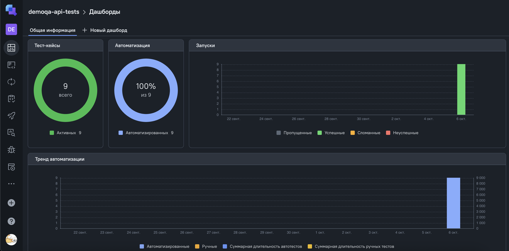
</p>

- ### Страница с тестами в TestOps

<p>
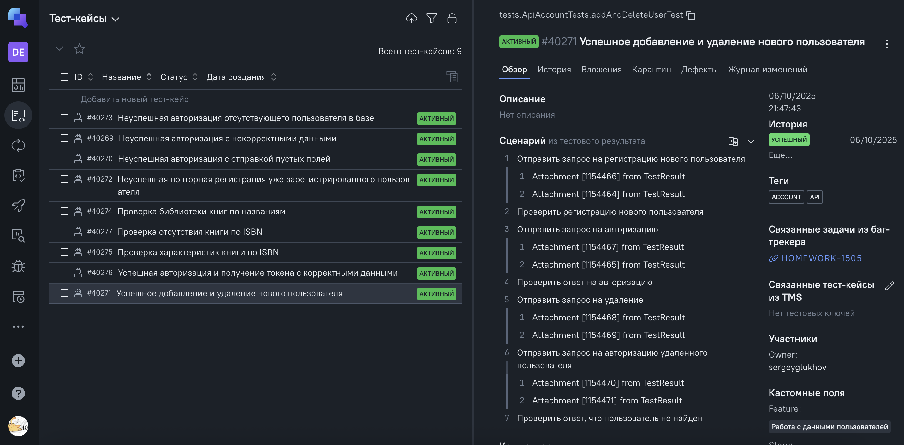
</p>

## :point_up_2: Интеграция с Jira

[Задача в Jira](https://jira.autotests.cloud/browse/HOMEWORK-1505)

- ### Страница с задачей в Jira
<p>
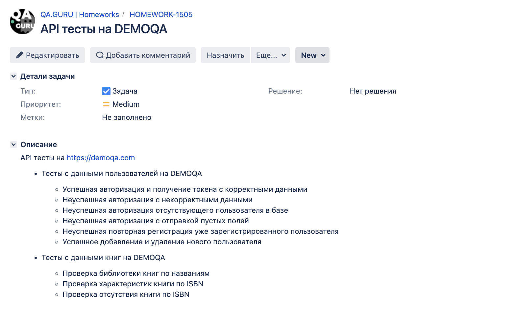
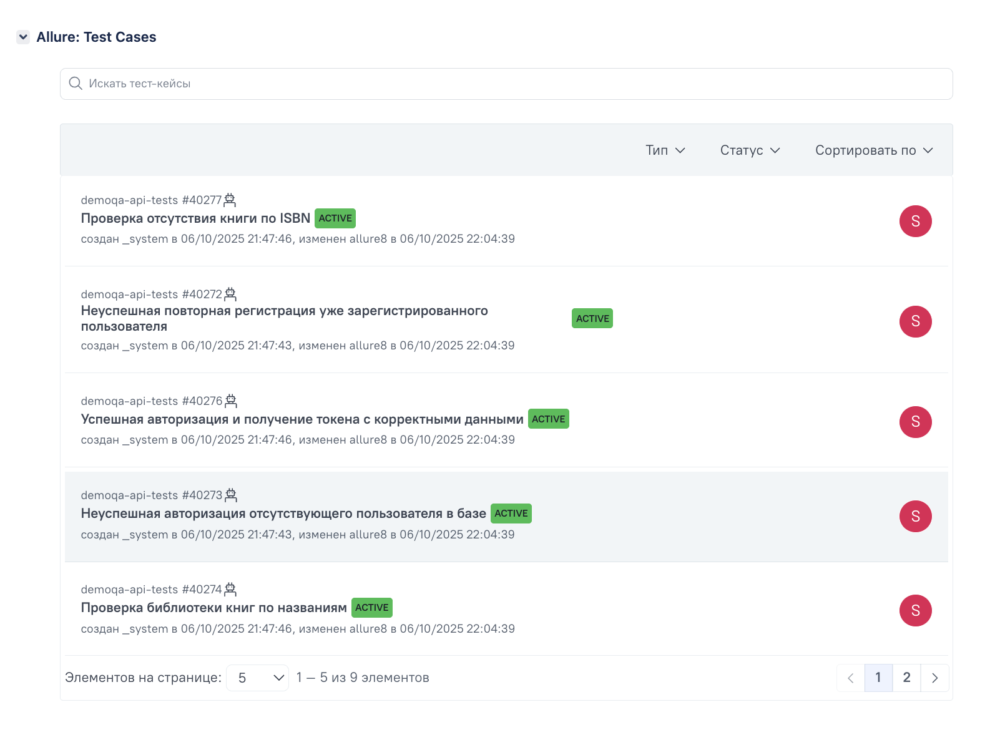
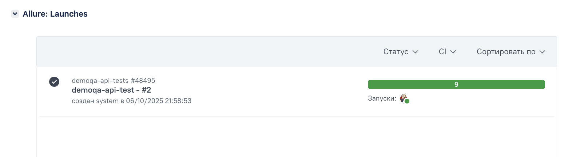
</p>

## :point_up_2: Отчет в Telegram
<p>
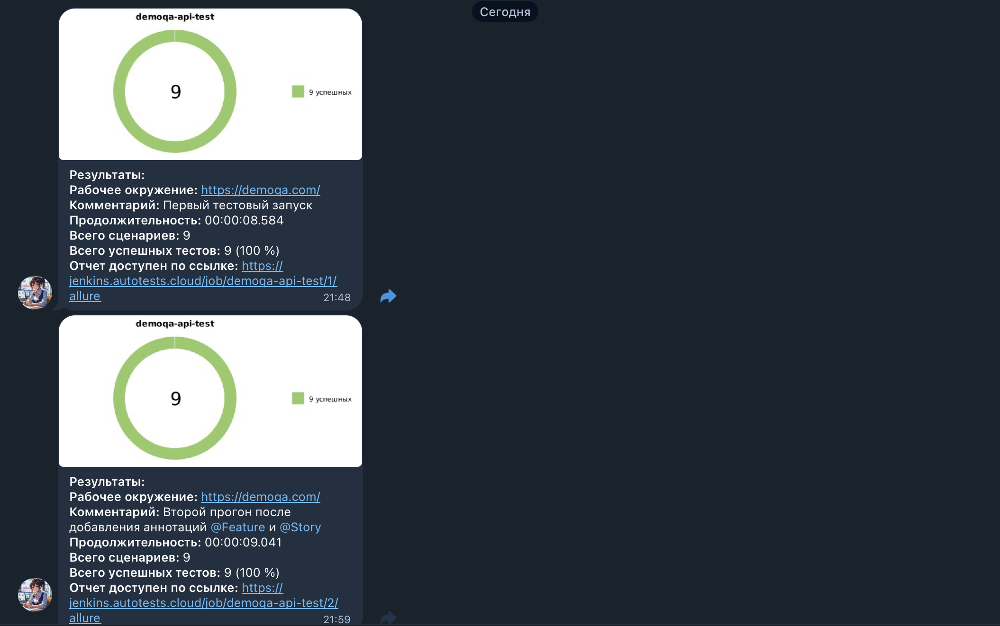
</p>
